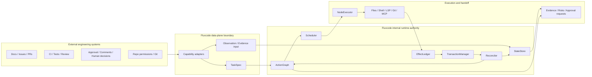
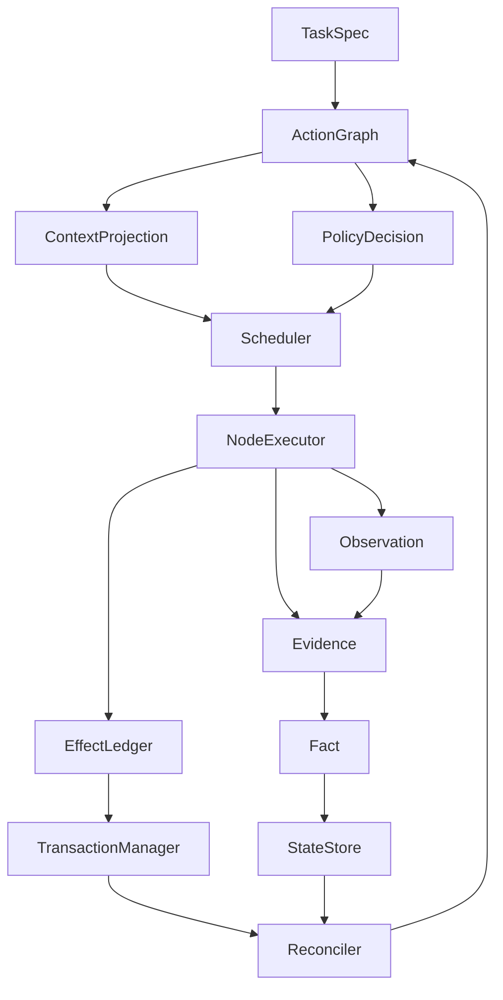

# Fluxcode Architecture Overview

## Document Status and Scope

This document is the current formal Fluxcode architecture overview draft. It is the top-level entry for the roadmap, module technical designs, and task breakdown under `docs/en-US/design/`. It describes the target architecture, module authority boundaries, and design constraints. It does not claim that the current `src/` implementation already provides these runtime-kernel capabilities.

Chinese counterpart: [`docs/zh-CN/design/architecture-overview.md`](../../zh-CN/design/architecture-overview.md).

This document separates facts, design goals, and non-goals as follows:

- **Facts**: The repository's current formal design document structure, declared toolchain, license, and terminology constraints.
- **Design goals**: Fluxcode's intended layering, execution loop, internal authority ownership, and external collaboration model as a harness-native code agent runtime.
- **Non-goals**: This document does not claim that the runtime kernel is implemented, and it does not describe external governance systems as Fluxcode internal authority.

## 1. Top-level Positioning

From the perspective of the whole software-engineering system, Fluxcode is a code-agent `Data Plane`: it reads repositories, calls tools, proposes changes, runs verification, produces evidence, and hands results to humans and existing engineering systems. Fluxcode does not replace repo permissions, CI, code review, compliance, release, or deployment gates.

Fluxcode still needs a local runtime authority. Every use of `Control Plane Authority` in this document means **Fluxcode internal runtime authority**. That authority exists only inside the Fluxcode runtime and a task execution boundary, where it manages facts, scheduling, effects, transactions, context projection, and recovery semantics.

Therefore, Fluxcode's top-level positioning is:

- Externally: an execution-oriented `Data Plane` code agent inside the engineering system, adapting to external inputs, tools, verification, and gate signals.
- Internally: a runtime with internal-runtime-scoped `Control Plane Authority` over runtime-native objects and state transitions such as `ActionGraph`, `StateStore`, `Scheduler`, `EffectLedger`, `TransactionManager`, and `Reconciler`.
- For humans: an auditable handoff surface for plans, evidence, risks, blockers, approval requests, and recovery suggestions; it does not replace human judgment.

## 2. Code Agent Operating Model

Before introducing a harness-native runtime, Fluxcode is first a code agent: it turns user intent into a constrained coding task, understands repository context, produces auditable changes, calls tools for execution and verification, and hands off diffs, evidence, risks, and blockers to humans and external engineering systems.

### 2.1 From User Task to Code Change

Fluxcode's task entry is not “let the model chat freely until it finishes”. It normalizes user input, documents, issues, comments, or external gate signals into a `TaskSpec`. A `TaskSpec` should at least preserve:

- User intent, target outcome, explicit acceptance criteria, and non-goals.
- Repository scope, allowed read / write paths, callable capabilities, and boundaries that require human approval.
- Known constraints, risks, blockers, external evidence, and verification requirements.
- Expected deliverable shape, such as a patch, diff summary, verification evidence, risk notes, or follow-up suggestions.

`TaskSpec` is still not an executable plan. It must be decomposed into `ActionNode` objects inside an `ActionGraph`, such as repository understanding, context selection, local change generation, verification, evidence summarization, human confirmation, or final handoff. This gives a code-agent task a traceable structure from the beginning instead of leaving it only inside a prompt transcript.

### 2.2 Repository Understanding, Modification, Verification, and Handoff

Fluxcode's code-agent operating model covers the full path from understanding to handoff:

| Phase | Code agent behavior | Typical output |
| --- | --- | --- |
| Repository understanding | Read the file tree, documentation, symbol definitions, type information, dependencies, call relationships, test locations, and historical constraints; select the minimal task-relevant context | `Observation`, candidate `Evidence`, `ContextProjection` input |
| Change generation | Produce a patch / `OverlayRevision`, perform local edits, structural replacements, or small rewrites; preserve the reason and impact scope | Auditable diff, overlay, change rationale, affected file list |
| Tool execution | Call filesystem, Git, shell, LSP, MCP, LLM, or external APIs through capability adapters; each call has a boundary, intent, and result record | Tool `Observation`, effect declaration, effect result, error evidence |
| Verification | Run tests, typecheck, LSP diagnostics, static checks, or task-specific smoke checks; ingest human review, CI, or approval gate signals | `validation_gate` evidence, failure diagnostics, risk downgrade, or blocked state |
| Handoff | Return diff, evidence, verification summary, risks, blockers, approval requests, and follow-up suggestions | Human-reviewable handoff, external gate input, recovery suggestions |

This model requires Fluxcode to handle code structure, tool side effects, and engineering collaboration results at the same time. LLMs may participate in understanding, modification, and explanation, but they cannot be the sole fact source, commit authority, or global scheduler.

### 2.3 Difference from a Plain `ReAct` Agent

A plain `ReAct` / transcript-driven agent pattern usually organizes the reason / action / observation loop around a prompt transcript: the model reasons from the current chat history, calls a tool, appends the observation back to the transcript, and reasons again. This pattern is useful for local exploration and short interactions, and it can also serve as an execution strategy inside a Fluxcode node.

Fluxcode does not describe `ReAct` as wrong or valueless. It limits the authority boundary of `ReAct` in the global architecture:

- `NodeExecutor` may use a bounded ReAct mini-loop inside a single exploratory `ActionNode`.
- Global task structure, blocking, recovery, and audit entry points are owned by `ActionGraph`, not implicitly carried by the transcript.
- Fact lifecycle is maintained by `StateStore`, promotion rules, and gates, not directly decided by the model's memory of chat history.
- Side effects such as file, shell, Git, network, and external API operations are declared, recorded, committed, rolled back, or marked non-compensable by `EffectLedger` / `TransactionManager`; tool logs or natural-language explanations are not substitutes.
- Verification gates, human approvals, budgets, retries, and rescheduling are managed by `Scheduler`, `PolicyDecision`, and `Reconciler`, not by hoping the next prompt retry converges.

Therefore, Fluxcode may use local `ReAct` inside nodes, but global task state, fact promotion, effect management, verification gates, and recovery semantics must not collapse into a transcript-driven loop.

### 2.4 Why Harness-native Runtime Is Needed

The code-agent operating model above naturally leads to a harness-native runtime:

- Long tasks span many tool calls, verification failures, human feedback points, and recovery points; a transcript alone should not carry their state.
- Code changes, shell commands, Git operations, external APIs, and human approvals can all produce side effects; they must be declared, recorded, compensated, or explicitly marked as non-recoverable.
- Verification and review gates must track freshness, coverage, failure causes, and affected nodes in a recoverable way.
- Human collaboration, blockers, recovery, and rescheduling require a graph, state store, ledger, and scheduler instead of relying on the model to “remember” what happened in the next turn.

The role of harness-native runtime is not to replace the code agent. It is the governance substrate for code-agent behavior: task structure, facts, context, tool capabilities, effects, verification, recovery, and handoff become auditable, recoverable, and collaborative runtime objects.

## 3. Harness-native Runtime: Governance Substrate for Code-agent Behavior

Based on this code-agent operating model, Fluxcode's harness-native runtime direction is “external compatibility, internal autonomy”.

- **External compatibility**: External documents, issues, PRs, approvals, CI, comments, repository permissions, test systems, and human reviews may all become inputs, evidence, constraints, or gate signals.
- **Internal autonomy**: External material cannot directly rewrite Fluxcode internal `Fact`, effect state, transaction state, or scheduling state. It must enter the runtime through adapters, evidence, promotion, gates, or reconcile semantics.

The diagram expresses the design boundary, not current implementation completeness. The key invariant is that external systems may provide signals, while Fluxcode internal state must be maintained by runtime-native objects and gate rules.

## 4. Runtime Loop

Fluxcode runtime turns a code-agent task into schedulable actions, actions into controlled effects, effects and observations into evidence, and evidence into facts or recovery actions according to explicit rules.

The loop has these key constraints:

1. `TaskSpec` is the task entry point, not an executable plan; it must be decomposed into an `ActionGraph` and `ActionNode` objects.
2. `ActionGraph` is an execution ledger, scheduling surface, audit index, and UX surface; it is not an omniscient state container.
3. `ContextProjection` creates node-specific minimal context from `StateStore` and task context, and should not be replaced by a prompt transcript.
4. `PolicyDecision` records policy choices, capability boundaries, risk handling, and gate results, and should not remain only as natural-language reasoning.
5. `Scheduler` decides when an `ActionNode` is ready, blocked, failed, or completed.
6. `NodeExecutor` may execute deterministic nodes, single-decision nodes, or bounded exploratory nodes, but it cannot bypass `EffectLedger`, `TransactionManager`, or `Reconciler`.
7. `Observation` and `Evidence` do not automatically become `Fact`; `Fact` must enter `StateStore` through a promotion rule, `TrustGate`, or equivalent gate mechanism.
8. `EffectLedger` records effect declarations, execution results, and compensation state; `TransactionManager` manages `OverlayRevision`, checkpoint, commit, rollback, and compensation.
9. `Reconciler` decides recovery, blocking, retry, or human handoff when graph, fact, effect, and transaction states diverge.

## 5. Key Modules and Authority Ownership

| Module / object | Main responsibility | Internal authority boundary | Must not be delegated to |
| --- | --- | --- | --- |
| `ActionGraph` / `ActionNode` | Task decomposition, dependencies, blockers, verification, recovery relations, audit index, and UX surface | Runtime representation of node state and graph relations | A single prompt, chat history, or external task table |
| `StateStore` | `Observation`, `Evidence`, versioned `Fact`, fact lifecycle, and `ContextProjection` inputs | Fact lifecycle, versions, coverage, and confidence | Transcript, raw tool output, or one graph blob |
| `ContextProjection` | Produce minimal, sourced, auditable context views for nodes | Node-visible context boundaries and references | Untrimmed full history or implicit model memory |
| `PolicyDecision` | Record strategy choice, permission judgment, risk handling, and gate decisions | Traceable representation of policy decisions | Unstructured natural-language rationale |
| `Scheduler` | `ActionNode` executability, dependencies, budget, blockers, and recovery points | Scheduling state and ready/blocked semantics | LLM natural-language reasoning |
| `NodeExecutor` | Execute nodes, call tools, produce observations, evidence, and effect requests | Single-node execution and bounded ReAct mini-loop | The global runtime controller |
| `EffectLedger` | Declaration, result, and compensation state for file, shell, network, Git, external API, and approval effects | Effect records, compensation state, and audit references | Tool logs or chat history |
| `TransactionManager` | `OverlayRevision`, checkpoint, commit, rollback, compensation, and transaction status | Transaction state, pre-commit verification, and rollback semantics | Patch text or model memory |
| `Reconciler` | Drift detection and recovery semantics across graph / fact / effect / transaction | Recovery, blocking, rescheduling, downgrade, and human takeover semantics | Prompt retry after failure |

## 6. Module Relationships

Module relationships follow the principle that plans, facts, effects, transactions, and recovery are separate concerns:

- `ActionGraph` connects task planning, scheduling state, and audit indexing, but it does not own final authority over facts or effects.
- `StateStore` owns the fact and evidence layers, but it does not directly execute tools or commit changes.
- `Scheduler` schedules nodes from graph, policy, state, and gate results, but it does not directly run tools.
- `NodeExecutor` is an executor, not the global decision-maker; exploratory execution must be bounded by a step budget, capability allowlist, read/write/effect boundary, evidence policy, and exit condition.
- `EffectLedger` records effect intent and results first; `TransactionManager` then decides overlay, checkpoint, commit, rollback, or compensation.
- `Reconciler` handles mismatches among runtime objects, including stale facts, partial effects, invalidated overlays, failed nodes, and stale verification.

### `Observation → Evidence → Fact` Promotion

Fluxcode does not treat tool output, model inference, or external collaboration material as facts by default.

| Layer | Meaning | Default state |
| --- | --- | --- |
| `Observation` | Raw observation from a tool, user, environment, or external system | Unreviewed; may be partial, noisy, or stale |
| `Evidence` | Traceable evidence carrier with source, time, boundary, summary, and artifact reference | Traceable, but still not a fact |
| `Fact` | Versioned fact promoted into `StateStore` by a promotion rule / `TrustGate` | Requires lifecycle, coverage, confidence, and `evidenceIds` |

An LLM natural-language inference defaults to `Hypothesis`. Each bounded mini-loop step produces `Event`, `Observation`, `PolicyDecision`, or `EvidenceRef` by default; it becomes a `Fact` only through `TrustGate` or an explicit promotion rule.

## 7. Key Design Constraints and Notes

### 7.1 Gate Taxonomy

| Gate kind | Owner | Typical input | Semantics after failure |
| --- | --- | --- | --- |
| `validation_gate` | verifier capability / `StateStore` | test, typecheck, LSP, tree-sitter evidence | Add verification, downgrade fact, or block node |
| `trust_gate` | trust policy / `StateStore` | trust zone, source, external effect scope | Escalate or abort; do not rely on prompt retry |
| `permission_gate` | capability resolver / permission store | capability grant, node scope, user authorization | Reject, ask user, or block |
| `human_approval_gate` | Human | risk summary, diff, non-compensable effect | Wait for user choice or abort |
| `transaction_gate` | `TransactionManager` | overlay status, rollback handle, verification freshness | Block commit / rollback / rebase |
| `reconcile_gate` | `Reconciler` | stale facts, partial effects, invalidated overlay, affected nodes | Repair state before further scheduling |

### 7.2 Node-level Bounded ReAct

Fluxcode rejects agent-level / global ReAct as the runtime main controller. It accepts node-level bounded ReAct as a local execution strategy used by `NodeExecutor` for exploratory `ActionNode` execution.

ReAct is an execution strategy, not the runtime architecture. Global scheduling, fact promotion, effect declaration, and commit / rollback remain owned by internal runtime authority services.

`NodeExecutor` supports three execution profiles:

| Profile | Use case | Mini-loop |
| --- | --- | --- |
| `deterministic` | Deterministic node with known inputs, capability, and output contract | None |
| `single_decision` | Node requiring one LLM `PolicyDecision` | None |
| `exploratory` | Node requiring local exploration, recall, or tentative verification | Bounded ReAct mini-loop |

The bounded mini-loop must have a step budget, capability allowlist, read/write/effect boundary, evidence policy, and exit condition. It cannot directly promote `Fact`, bypass `EffectLedger`, directly commit / rollback, or modify global scheduling.

### 7.3 Current Architecture Invariants

- Fluxcode is externally a code-agent `Data Plane`, not an external engineering governance `Control Plane`.
- Every `Control Plane Authority` reference must be scoped to Fluxcode internal runtime authority.
- `ActionGraph` is a ledger, scheduling surface, recovery entry, audit index, and UX surface, not an omniscient state container.
- `Observation`, `Evidence`, and `Fact` remain separate; `Fact` can only be promoted by promotion rules / gates.
- External documents, issues, PRs, approvals, CI, comments, and human signals can only be inputs, evidence, or gate signals, and cannot bypass runtime internal authority.
- `NodeExecutor` may use node-level bounded ReAct, but the global runtime architecture must not collapse into an agent-level ReAct loop.
- Design documents are drafts and must not imply that these capabilities are fully implemented.

## 8. External Collaboration and Governance Boundary

Fluxcode must coexist with existing engineering collaboration and governance systems. External systems may provide constraints, context, evidence, or gate signals, but they are not Fluxcode runtime internal sources of truth or commit authority.

| External object / system | Role in Fluxcode | Runtime ingestion path | What it cannot do |
| --- | --- | --- | --- |
| Documents, requirement notes, design drafts | User intent, constraints, acceptance context, design basis | Parsed into `TaskSpec`, candidate `Observation`, and sourced `Evidence` | Directly write `Fact` |
| Issues / project-management items | External tasks, priorities, collaboration state | Mapped into task constraints and candidate `ActionGraph` / `ActionNode` inputs | Replace `Scheduler` ready/blocked judgment |
| PRs / code review | External review comments, diff discussion, merge context | Used as `Evidence`, `human_approval_gate`, or `validation_gate` input | Bypass `TransactionManager` commit state |
| CI / tests / static checks | Verification signals and failure evidence | Used as `validation_gate` evidence and may trigger reconcile | Promote every inference to `Fact` automatically |
| Approval / compliance / release process | External governance gate | Used as gate signal or human handoff result | Become Fluxcode internal `Control Plane Authority` |
| Comments / chats / human confirmations | Human feedback, blocker explanation, approval, or rejection | Used as user-provided `Observation`, `Evidence`, or `human_approval_gate` input | Bypass evidence and promotion rules |

This means external material may influence Fluxcode tasks, plans, verification, and recovery, but it must preserve source, boundary, and an auditable path.

## 9. Non-goals

This architecture overview explicitly excludes the following goals:

- Do not design Fluxcode as an external engineering governance `Control Plane`.
- Do not replace repo permissions, CI, code review, compliance, release, or deployment gates.
- Do not treat external documents, issues, PRs, approvals, CI, or comments as internal runtime authority.
- Do not design `ActionGraph` as an omniscient state database.
- Do not use prompt transcripts, model memory, or tool logs as a fact lifecycle system.
- Do not make an agent-level global ReAct loop the runtime main controller.
- Do not claim in this document that the runtime kernel is already implemented.

## 10. Drill-down Document Index

| Document | Role |
| --- | --- |
| This document | Current formal architecture overview; defines top-level positioning, the code agent operating model, difference from a plain `ReAct` agent, harness-native runtime governance substrate, runtime loop, key module authority, external boundaries, and non-goals |
| [`runtime-kernel-roadmap-v0.1-v0.5.md`](./runtime-kernel-roadmap-v0.1-v0.5.md) | Version goals and cross-version invariants from `v0.1` through `v0.5` |
| [`runtime-kernel-task-breakdown.md`](./runtime-kernel-task-breakdown.md) | Independent task breakdown with tasks, dependencies, acceptance criteria, and non-goals per version |
| [`modules/action-graph.md`](./modules/action-graph.md) | Technical design for `ActionGraph` / `ActionNode` |
| [`modules/state-store.md`](./modules/state-store.md) | Technical design for `StateStore`, `Observation`, `Evidence`, `Fact`, and fact lifecycle |
| [`modules/scheduler.md`](./modules/scheduler.md) | Technical design for `Scheduler` scheduling, invariants, blocking, and recovery |
| [`modules/effect-ledger.md`](./modules/effect-ledger.md) | Technical design for `EffectLedger` effect records and compensation state |
| [`modules/transaction-manager.md`](./modules/transaction-manager.md) | Technical design for `TransactionManager`, `OverlayRevision`, checkpoint, commit, and rollback |
| [`modules/reconciler.md`](./modules/reconciler.md) | Technical design for `Reconciler` drift detection, recovery, and human takeover |
| [`modules/policy-core-and-guard.md`](./modules/policy-core-and-guard.md) | Technical design for `PolicyDecision`, policy core, guard, and gates |
| [`modules/capability-adapter.md`](./modules/capability-adapter.md) | Technical design for capability adapters, tool-call boundaries, and runtime-native outputs |
| [`modules/context-projection.md`](./modules/context-projection.md) | Technical design for `ContextProjection` |
| [`modules/node-executor.md`](./modules/node-executor.md) | Technical design for `NodeExecutor` execution profiles and node-level bounded ReAct |
