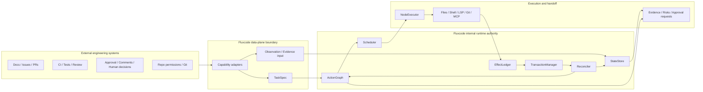
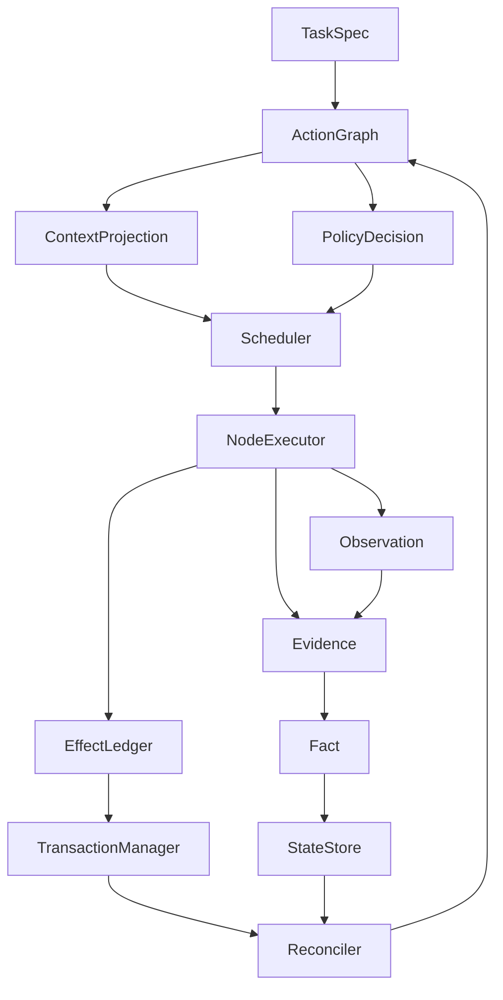

# Fluxcode 架构设计总览

## 文档状态与适用边界

本文是 Fluxcode 当前正式设计总览草案，用于作为 `docs/zh-CN/design/` 下路线图、模块技术设计和任务拆分的顶层入口。它描述的是目标架构、模块权威边界和设计约束，不表示当前 `src/` 已经实现这些 runtime-kernel 能力。

英文对应文档：[`docs/en-US/design/architecture-overview.md`](../../en-US/design/architecture-overview.md)。

本文中的事实、设计目标和非目标采用以下边界：

- **事实**：仓库当前的正式设计文档结构、声明工具链、许可证和术语约束。
- **设计目标**：Fluxcode 作为 harness-native code agent runtime 的目标分层、运行闭环、内部权威归属和外部协作方式。
- **非目标**：本文不会声明 runtime-kernel 已完成实现，也不会把外部治理系统描述为 Fluxcode 内部权威。

## 1. 顶层定位

从整个软件工程系统视角看，Fluxcode 是 code agent `Data Plane`：它读取仓库、调用工具、生成修改、运行验证、产出证据，并把结果交给人类和既有工程系统判断。Fluxcode 不取代 repo permissions、CI、code review、compliance、release 或 deployment gates。

Fluxcode 内部仍需要本地 runtime authority。本文中的 `Control Plane Authority` 一律指 **Fluxcode internal runtime authority**，其权威只存在于 Fluxcode runtime 和单次任务执行边界内，用于管理事实、调度、副作用、事务、上下文投影和恢复语义。

因此，Fluxcode 的顶层定位是：

- 对外：作为工程系统中的执行型 `Data Plane` code agent，适配外部输入、工具、验证和 gate 信号。
- 对内：通过 internal-runtime-scoped `Control Plane Authority` 管理 `ActionGraph`、`StateStore`、`Scheduler`、`EffectLedger`、`TransactionManager`、`Reconciler` 等 runtime-native 对象和状态迁移。
- 对人：提供可审计的计划、证据、风险、阻塞、确认请求和恢复建议，不替代人工判断。

## 2. Code Agent 工作模型

在引入 harness-native runtime 之前，Fluxcode 首先是一个 code agent：它把用户意图转化为受约束的代码任务，在仓库中理解上下文，生成可审计修改，调用工具执行和验证，并把 diff、证据、风险和阻塞交付给人类与外部工程系统。

### 2.1 从用户任务到代码变更

Fluxcode 的任务入口不是“让模型自由聊天直到完成”，而是把用户输入、文档、Issue、评论或外部 gate 信号规范化为 `TaskSpec`。`TaskSpec` 至少需要保留：

- 用户意图、目标结果、显式验收条件和非目标。
- 仓库范围、允许读取 / 写入的路径、可调用能力和需要人工确认的边界。
- 已知约束、风险、阻塞、外部证据和验证要求。
- 交付形态，例如 patch、diff 摘要、验证证据、风险说明或后续建议。

`TaskSpec` 仍然不是可执行计划。它需要被拆解为 `ActionGraph` 中的 `ActionNode`，例如理解仓库、选择上下文、生成局部修改、运行验证、整理证据、请求人工确认或交付结果。这样，code-agent task 从一开始就具有可追踪的结构，而不是只存在于 prompt transcript 中。

### 2.2 仓库理解、修改、验证与交付

Fluxcode 的 code-agent operating model 覆盖从理解到交付的完整链路：

| 阶段 | Code agent 行为 | 典型产物 |
| --- | --- | --- |
| 仓库理解 | 读取文件树、文档、符号定义、类型信息、依赖、调用关系、测试位置和历史约束；选择与任务相关的最小上下文 | `Observation`、候选 `Evidence`、`ContextProjection` 输入 |
| 修改生成 | 生成 patch / `OverlayRevision`，执行局部编辑、结构化替换或小步重写；保留变更原因和影响范围 | 可审计 diff、overlay、修改理由、受影响文件列表 |
| 工具执行 | 通过 capability adapter 调用 filesystem、Git、shell、LSP、MCP、LLM 或外部 API；每次调用带有边界、意图和结果记录 | 工具 `Observation`、effect 声明、effect 结果、错误证据 |
| 验证 | 运行 test、typecheck、LSP diagnostics、静态检查或任务特定 smoke check；接收人工 review、CI 或审批 gate 信号 | `validation_gate` evidence、失败诊断、风险降级或阻塞状态 |
| 交付 | 输出 diff、证据、验证摘要、风险、阻塞、人工确认请求和后续建议 | 人类可审查的 handoff、外部 gate 输入、恢复建议 |

这个模型要求 Fluxcode 同时处理代码结构、工具副作用和工程协作结果。LLM 可以参与理解、修改和解释，但不能单独成为事实来源、提交权威或全局调度器。

### 2.3 与普通 `ReAct` agent 的区别

普通 `ReAct` / transcript-driven agent pattern 通常把 reason / action / observation 循环组织在 prompt transcript 周围：模型根据当前聊天历史推理下一步，调用工具，把 observation 追加回 transcript，再继续推理。这种模式适合局部探索和短程交互，也可以作为 Fluxcode 节点内部的执行策略。

Fluxcode 不把 `ReAct` 描述为错误或无价值；它限制的是 `ReAct` 在全局架构中的权威边界：

- `NodeExecutor` 可以在单个 exploratory `ActionNode` 内使用 bounded ReAct mini-loop。
- 全局任务结构、阻塞、恢复和审计入口由 `ActionGraph` 承担，不由 transcript 隐式承载。
- 事实生命周期由 `StateStore`、promotion rule 和 gate 维护，不由模型对聊天历史的记忆直接决定。
- 文件、shell、Git、网络和外部 API 等副作用由 `EffectLedger` / `TransactionManager` 声明、记录、提交、回滚或标记不可补偿，不由工具日志或自然语言说明替代。
- 验证 gate、人工确认、预算、重试和重新调度由 `Scheduler`、`PolicyDecision` 和 `Reconciler` 管理，不由下一轮 prompt retry 自行收敛。

因此，Fluxcode 可以在节点内部使用局部 `ReAct`，但不能让 global task state、fact promotion、effect management、verification gate 或 recovery semantics 退化为 transcript-driven loop。

### 2.4 为什么需要 harness-native runtime

上述 code-agent 工作模型自然引出 harness-native runtime：

- 长任务会跨越多轮工具调用、验证失败、人工反馈和恢复点，不能只靠 transcript 承载状态。
- 代码修改、shell、Git、外部 API 和人工确认都可能产生副作用，需要声明、记录、补偿，或明确标记为不可恢复。
- 验证和 review gate 需要可恢复地追踪 freshness、覆盖范围、失败原因和受影响节点。
- 人类协作、阻塞、恢复和重新调度需要 graph、state、ledger 与 scheduler，而不是依赖模型在下一轮对话中“记得”上一轮发生了什么。

Harness-native runtime 的作用不是取代 code agent，而是为 code-agent 行为提供治理底座：让任务结构、事实、上下文、工具能力、副作用、验证、恢复和交付都成为可审计、可恢复、可协作的 runtime 对象。

## 3. Harness-native runtime：code-agent 行为的治理底座

基于上述 code-agent 工作模型，Fluxcode 的 harness-native runtime 方向是“外兼容，内自治”。

- **外兼容**：外部文档、Issue、PR、审批、CI、评论、代码仓库权限、测试系统和人工评审都可以成为输入、证据、约束或 gate 信号。
- **内自治**：外部材料不能直接改写 Fluxcode 内部 `Fact`、effect 状态、transaction 状态或 scheduling 状态；它们必须经过 adapter、evidence、promotion、gate 或 reconcile 语义进入 runtime。

上图表达的是设计边界，不是当前实现完成度声明。关键不变量是：外部系统可以提供信号，但 Fluxcode 内部状态必须由 runtime-native 对象和 gate 规则维护。

## 4. 运行闭环

Fluxcode runtime 的基本闭环是把 code-agent task 转化为可调度行动，把行动转化为受控 effect，把 effect 与观察转化为证据，再按规则晋升为事实或触发恢复。

闭环中的关键约束：

1. `TaskSpec` 是任务入口，不等于可执行计划；它需要被分解为 `ActionGraph` 和 `ActionNode`。
2. `ActionGraph` 是执行账本、调度表面、审计索引和 UX 表面，不是全知状态容器。
3. `ContextProjection` 从 `StateStore` 和任务上下文生成面向节点的最小上下文，不应由 prompt transcript 直接替代。
4. `PolicyDecision` 记录策略选择、能力边界、风险判断和 gate 结果，不应只停留在自然语言推理中。
5. `Scheduler` 决定 `ActionNode` 何时 ready、blocked、failed 或 completed。
6. `NodeExecutor` 可以执行确定性节点、单次决策节点或有界探索节点，但不能绕过 `EffectLedger`、`TransactionManager` 或 `Reconciler`。
7. `Observation` 和 `Evidence` 不自动成为 `Fact`；`Fact` 必须经过 promotion rule、`TrustGate` 或等价 gate 机制进入 `StateStore`。
8. `EffectLedger` 记录副作用声明、执行结果和补偿状态；`TransactionManager` 管理 `OverlayRevision`、checkpoint、commit、rollback 和 compensation。
9. `Reconciler` 在 graph、fact、effect、transaction 失配时决定恢复、阻塞、重试或交给人工处理。

## 5. 关键模块与权威归属

| 模块 / 对象 | 主要责任 | 内部权威边界 | 不应委托给 |
| --- | --- | --- | --- |
| `ActionGraph` / `ActionNode` | 任务分解、依赖、阻塞、验证、恢复关系、审计索引和 UX 表面 | 节点状态和 graph 关系的 runtime 表达 | 单个 prompt、聊天记录或外部任务表 |
| `StateStore` | `Observation`、`Evidence`、versioned `Fact`、fact lifecycle、`ContextProjection` 输入 | 事实生命周期、版本、覆盖范围和 confidence | transcript、工具原始输出或单个 graph blob |
| `ContextProjection` | 为节点生成最小、带来源、可审计的上下文视图 | 节点可见上下文的边界与引用 | 未裁剪的全量历史或隐式模型记忆 |
| `PolicyDecision` | 记录策略选择、权限判断、风险处理和 gate 决策 | 策略决策的可追溯表示 | 未结构化自然语言理由 |
| `Scheduler` | `ActionNode` 可执行性、依赖、预算、阻塞、恢复点 | 调度状态和 ready/blocked 语义 | LLM 自然语言推理 |
| `NodeExecutor` | 执行节点，调用工具，产出 observation、evidence 和 effect 请求 | 单节点执行过程和 bounded ReAct mini-loop | 全局 runtime 控制器 |
| `EffectLedger` | 文件、shell、network、Git、外部 API、用户确认等 effect 的声明、结果和补偿状态 | effect 记录、补偿状态和审计引用 | 工具日志或聊天记录 |
| `TransactionManager` | `OverlayRevision`、checkpoint、commit、rollback、compensation、transaction status | 事务状态、提交前验证和回滚语义 | patch 文本或模型记忆 |
| `Reconciler` | graph / fact / effect / transaction 的失配检测和恢复语义 | 恢复、阻塞、重排、降级和人工接管语义 | 失败后的 prompt retry |

## 6. 模块间关系

模块间关系遵循“计划、事实、副作用、事务、恢复分离”的原则：

- `ActionGraph` 连接任务计划、调度状态和审计索引，但不拥有事实和副作用最终权威。
- `StateStore` 负责事实和证据层，不直接执行工具或提交修改。
- `Scheduler` 只根据 graph、policy、state 和 gate 结果调度节点，不直接运行工具。
- `NodeExecutor` 是执行者，不是全局决策者；探索型执行必须受 step budget、capability allowlist、read/write/effect boundary、evidence policy 和 exit condition 约束。
- `EffectLedger` 先记录 effect 意图和结果，`TransactionManager` 再决定 overlay、checkpoint、commit、rollback 或 compensation。
- `Reconciler` 处理 runtime 对象之间的失配，例如 stale facts、partial effects、invalidated overlay、失败节点和过期验证。

### `Observation → Evidence → Fact` promotion

Fluxcode 不把工具输出、模型推断或外部协作材料直接当成事实。

| 层级 | 含义 | 默认状态 |
| --- | --- | --- |
| `Observation` | 工具、用户、环境或外部系统产生的原始观察 | 未审查，可能局部、噪声或过期 |
| `Evidence` | 带来源、时间、边界、摘要和 artifact 引用的证据载体 | 可追溯，但仍不等于事实 |
| `Fact` | 经 promotion rule / `TrustGate` 晋升进 `StateStore` 的版本化事实 | 必须有 lifecycle、coverage、confidence、evidenceIds |

LLM 的自然语言推断默认只能成为 `Hypothesis`。mini-loop 中的每一步默认产生 `Event`、`Observation`、`PolicyDecision` 或 `EvidenceRef`；只有通过 `TrustGate` 或明确 promotion rule 后，才可成为 `Fact`。

## 7. 关键设计约束与注意事项

### 7.1 Gate taxonomy

| Gate kind | Owner | 典型输入 | 失败语义 |
| --- | --- | --- | --- |
| `validation_gate` | verifier capability / `StateStore` | test、typecheck、LSP、tree-sitter evidence | 补充验证、降级 fact、阻塞节点 |
| `trust_gate` | trust policy / `StateStore` | trust zone、来源、外部 effect scope | escalate 或 abort，不靠 prompt retry |
| `permission_gate` | capability resolver / permission store | capability grant、node scope、用户授权 | reject、ask user 或阻塞 |
| `human_approval_gate` | Human | risk summary、diff、不可补偿 effect | 等待用户选择或中止 |
| `transaction_gate` | `TransactionManager` | overlay status、rollback handle、verification freshness | 阻止 commit / rollback / rebase |
| `reconcile_gate` | `Reconciler` | stale facts、partial effects、invalidated overlay、affected nodes | 先修复状态再继续调度 |

### 7.2 Node-level bounded ReAct

Fluxcode 反对的是 agent-level / global ReAct 作为 runtime 主控制器；接受的是 node-level bounded ReAct，作为 `NodeExecutor` 执行探索型 `ActionNode` 的局部 execution strategy。

ReAct 是执行策略，不是 runtime architecture。全局调度、事实晋升、副作用声明和提交 / 回滚仍由内部 runtime authority services 负责。

`NodeExecutor` 支持三类 execution profile：

| Profile | 用途 | Mini-loop |
| --- | --- | --- |
| `deterministic` | 已知输入、能力和输出契约的确定性节点 | 无 |
| `single_decision` | 需要一次 LLM `PolicyDecision` 的节点 | 无 |
| `exploratory` | 需要局部探索、召回、试探验证的节点 | 有界 ReAct mini-loop |

有界 mini-loop 必须有 step budget、capability allowlist、read/write/effect boundary、evidence policy 和 exit condition。它不能直接晋升 `Fact`，不能绕过 `EffectLedger`，不能直接 commit / rollback，也不能修改全局调度。

### 7.3 当前架构不变量

- Fluxcode externally 是 code agent `Data Plane`，不是外部工程治理 `Control Plane`。
- 所有 `Control Plane Authority` 表述都必须限定为 Fluxcode internal runtime authority。
- `ActionGraph` 是账本、调度表面、恢复入口、审计索引和 UX 表面，不是全知状态容器。
- `Observation`、`Evidence`、`Fact` 必须分层，`Fact` 只能由 promotion rule / gate 晋升。
- 外部文档、Issue、PR、审批、CI、评论和人工信号只能作为输入、证据或 gate 信号，不能绕过 runtime 内部权威。
- `NodeExecutor` 可使用 node-level bounded ReAct，但 global runtime architecture 不能退化为 agent-level ReAct loop。
- 设计文档是 design draft，不得暗示这些能力已经全部实现。

## 8. 外部协作与治理边界

Fluxcode 需要与既有工程协作和治理系统共存。外部系统可以提供约束、上下文、证据或 gate 信号，但它们不是 Fluxcode runtime 的内部事实源或提交权威。

| 外部对象 / 系统 | 在 Fluxcode 中的角色 | 进入 runtime 的方式 | 不能做什么 |
| --- | --- | --- | --- |
| 文档、需求说明、设计稿 | 用户意图、约束、验收背景、设计依据 | 解析为 `TaskSpec`、candidate `Observation`、sourced `Evidence` | 不能直接写入 `Fact` |
| Issue / 项目管理项 | 外部任务、优先级、协作状态 | 映射为任务约束、候选 `ActionGraph` / `ActionNode` 输入 | 不能替代 `Scheduler` 的 ready/blocked 判断 |
| PR / code review | 外部审查意见、diff 讨论、合入上下文 | 作为 `Evidence`、`human_approval_gate` 或 `validation_gate` 输入 | 不能绕过 `TransactionManager` 提交状态 |
| CI / 测试 / 静态检查 | 验证信号和失败证据 | 作为 `validation_gate` evidence，必要时触发 reconcile | 不能自动晋升所有推断为 `Fact` |
| 审批 / 合规 / 发布流程 | 外部治理 gate | 作为 gate signal 或 human handoff 结果 | 不能成为 Fluxcode 内部 `Control Plane Authority` |
| 评论 / 聊天 / 人工确认 | 人工反馈、阻塞解释、确认或拒绝 | 作为 user-provided `Observation`、`Evidence` 或 `human_approval_gate` 输入 | 不能绕过 evidence 和 promotion 规则 |

这意味着外部材料可以影响 Fluxcode 的任务、计划、验证和恢复，但必须保留来源、边界和可审计路径。

## 9. 非目标

当前架构总览明确排除以下目标：

- 不把 Fluxcode 设计为外部工程治理 `Control Plane`。
- 不替代 repo permissions、CI、code review、compliance、release 或 deployment gates。
- 不把外部文档、Issue、PR、审批、CI 或评论作为内部 runtime 权威。
- 不把 `ActionGraph` 设计成全知状态数据库。
- 不把 prompt transcript、模型记忆或工具日志作为事实生命周期系统。
- 不把 agent-level global ReAct loop 作为 runtime 主控制器。
- 不在本文中声明 runtime-kernel 已完成实现。

## 10. 下钻文档索引

| 文档 | 角色 |
| --- | --- |
| 本文 | 当前正式架构总览，定义顶层定位、code agent 工作模型、与普通 `ReAct` agent 的区别、harness-native runtime 治理底座、运行闭环、关键模块权威、外部边界和非目标 |
| [`runtime-kernel-roadmap-v0.1-v0.5.md`](./runtime-kernel-roadmap-v0.1-v0.5.md) | v0.1-v0.5 的阶段目标和跨版本不变量 |
| [`runtime-kernel-task-breakdown.md`](./runtime-kernel-task-breakdown.md) | 独立任务拆分，记录每个版本的任务、依赖、验收和非目标 |
| [`modules/action-graph.md`](./modules/action-graph.md) | `ActionGraph` / `ActionNode` 模块技术设计 |
| [`modules/state-store.md`](./modules/state-store.md) | `StateStore`、`Observation`、`Evidence`、`Fact` 和事实生命周期设计 |
| [`modules/scheduler.md`](./modules/scheduler.md) | `Scheduler` 调度、不变量、阻塞和恢复设计 |
| [`modules/effect-ledger.md`](./modules/effect-ledger.md) | `EffectLedger` 副作用记录和补偿状态设计 |
| [`modules/transaction-manager.md`](./modules/transaction-manager.md) | `TransactionManager`、`OverlayRevision`、checkpoint、commit / rollback 设计 |
| [`modules/reconciler.md`](./modules/reconciler.md) | `Reconciler` 失配检测、恢复和人工接管设计 |
| [`modules/policy-core-and-guard.md`](./modules/policy-core-and-guard.md) | `PolicyDecision`、policy core、guard 和 gate 设计 |
| [`modules/capability-adapter.md`](./modules/capability-adapter.md) | capability adapter、工具调用边界和 runtime-native 输出设计 |
| [`modules/context-projection.md`](./modules/context-projection.md) | `ContextProjection` 上下文投影设计 |
| [`modules/node-executor.md`](./modules/node-executor.md) | `NodeExecutor` 执行 profile 和 node-level bounded ReAct 设计 |
